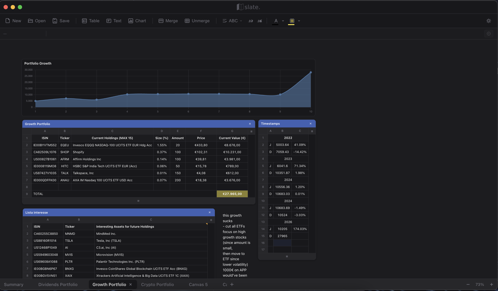

# Slate


Slate is a **free and open-source, canvas-based spreadsheet app** for desktop built with **Electron**, **Vue 3**, and TypeScript. Inspired by Apple Numbers, Slate brings a design-forward, layout-first spreadsheet experience to every platform — tables, charts, and text boxes arranged freely on an infinite canvas.

> **Note:** This app runs natively on **Desktop** (macOS, Windows, Linux). All files are saved as `.slate` files on your local machine.

# Demo


## Features

### Canvas & Layout
- **Canvas-based workspace** — tables, charts, and text boxes on an infinite pannable, zoomable canvas
- **Multi-canvas support** — organize your work across multiple canvases (like sheets/tabs)
- **Rich text boxes** — free-form text with font, color, alignment, and border controls
- **Dark & light themes**

### Spreadsheet
- **Formula engine** — 29 built-in functions (SUM, AVERAGE, IF, CONCAT, and more) with cell/range references
- **Cross-table & cross-canvas references** — reference cells across tables and canvases in formulas
- **Cell formatting** — bold, italic, text/fill colors, alignment, font family
- **Cell merging** — merge and unmerge arbitrary rectangular regions
- **Smart cell types** — auto-detection of numbers, percentages, currency (USD/EUR), URLs, booleans, and text

### Charts
- **7 chart types** — Bar, Line, Area, Pie, Doughnut, Scatter, and Radar
- **Auto-updating data binding** — charts update live as spreadsheet data changes

### Files
- **Native file format** — `.slate` files (JSON-based, versioned)
- **Cross-platform** — macOS, Windows, and Linux builds

## Getting Started

### Prerequisites
- Node.js (v18+ recommended)
- npm

### Setup

1. **Clone the repository**
```sh
git clone https://github.com/larrydarko1/slate.git
cd slate
```

2. **Install dependencies**
```sh
npm install
```

3. **Run in development mode**
```sh
npm run dev
```

### Testing

```sh
npm test          # watch mode
npm run test:run  # single run
```

### Building for Production

```sh
# Build for macOS
npm run build:mac

# Build for Windows
npm run build:win

# Build for Linux
npm run build:linux
```

Builds are output to the `dist-electron/` directory:
- **macOS:** `.dmg` installer
- **Windows:** `.exe` installer (NSIS)
- **Linux:** `.AppImage` file

## Tech Stack
- **Desktop:** Electron (native macOS, Windows, Linux app)
- **Frontend:** Vue 3, TypeScript, Vite, SCSS
- **Charts:** [Chart.js](https://www.chartjs.org/) + [vue-chartjs](https://vue-chartjs.org/)
- **Testing:** Vitest
- **Build Tools:** Vite + Electron Builder

## Project Structure

```
slate/
├── index.html                # Electron entry HTML
├── vite.config.ts            # Vite + Vitest config
├── generate-icons.sh         # Icon generation script (macOS iconutil)
├── electron/                 # Electron main process & preload
│   ├── main.cjs
│   └── preload.cjs
├── src/
│   ├── App.vue               # Root Vue component
│   ├── main.ts               # Vue app entry point
│   ├── style.scss            # Global styles
│   ├── vite-env.d.ts         # Vite client type declarations
│   ├── assets/               # Source assets (PSD files, etc.)
│   ├── components/           # Vue components
│   │   ├── CanvasWorkspace.vue   # Infinite canvas with pan/zoom
│   │   ├── SpreadsheetTable.vue  # Table grid & cell editing
│   │   ├── CanvasChart.vue       # Chart element on canvas
│   │   ├── CanvasTextBox.vue     # Rich text box element
│   │   ├── CanvasTabs.vue        # Multi-canvas tab bar
│   │   ├── Toolbar.vue           # Main toolbar
│   │   ├── FormulaBar.vue        # Formula input bar
│   │   ├── TitleBar.vue          # Custom title bar
│   │   └── ContextMenu.vue       # Right-click context menu
│   ├── composables/          # Vue composables
│   │   └── useSpreadsheet.ts     # Core spreadsheet state & logic
│   ├── engine/               # Formula parser & cell type system
│   │   ├── formula.ts            # Formula tokenizer, parser & evaluator
│   │   └── cellTypes.ts          # Cell type detection & parsing
│   └── types/                # TypeScript type definitions
│       ├── spreadsheet.ts        # Spreadsheet data types
│       └── electron.d.ts         # Electron API type declarations
├── public/                   # Static assets (icons, logos)
└── build/                    # Build resources (app icons, .icns)
```

## Contributing
See [CONTRIBUTING.md](CONTRIBUTING.md) for guidelines.

## Code of Conduct
This project follows the [Contributor Covenant Code of Conduct](CODE_OF_CONDUCT.md).

## License
This project is licensed under the MIT License. See [LICENSE](LICENSE) for details.

---

**Made with Vue 3, Electron, and a love for design-forward software.**

